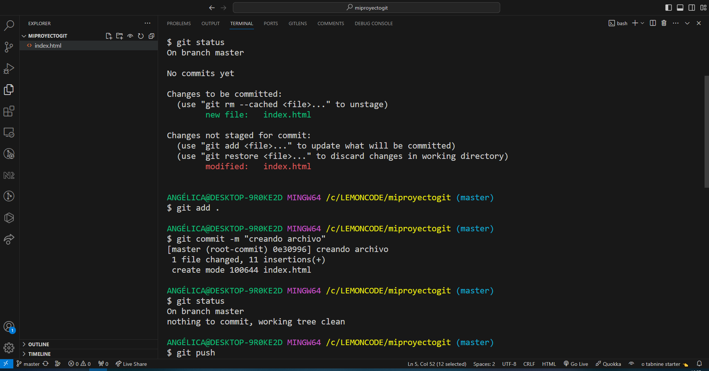

# Proceso de realización Laboratorio Git

1. Abro terminal desde VSC. Navego hasta la carpeta en local donde quiero crear el repositorio y mediante el comando mkdir creo la carpeta.

    Para inicializar el repo comando git init.

2. Creo nuevo repositorio en github con nombre "miproyectogit". Desde local con la terminal conectamos con remoto mediante el comando: git remote add origin git@github.com:rosaanli/miproyectogit.git

3. Creo dentro de la carpeta el archivo index.html y agrego algo de codigo. Despues lo paso a stagging (git add .), por ultimo realizo el commit con el mensaje "creando archivo" ( git commit -m "creando archivo")

    Subo a github con git push.

4. Creo la rama development y la establezco como activa (git checkout -b development).

<image src="./images/crear-y-cambiar-rama.png">

 Realizo cambios en el archivo index.html y commit.

<image src="./images/cambios-commit.PNG">

    Publico la rama en github con git push origin development.

<image src="./images/subiendo-cambios-a-github.png"/>

5. Vuelvo a la rama master y realizo merge (git merge development)

<image src="./images/merge.png"/>

Push final

<image src="./images/push-final.png">